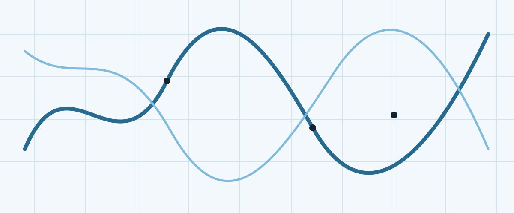

::: {.draft-note}
This is scaffold content, intentionally brief. Replace or remove this draft when the first real post is ready.
:::

## A heading for a technical note

Posts are ordinary Quarto Markdown. They can include links to the [GenomeSpy documentation](https://genomespy.app/docs/), images, citations [@lavikka2024], equations such as $y = \sin(x)$, and raw HTML.



### A small code block

```json
{
  "mark": "point",
  "encoding": {
    "x": { "field": "position", "type": "quantitative" },
    "y": { "field": "score", "type": "quantitative" }
  }
}
```

### An interactive embed

The current GenomeSpy docs recommend importing the browser-ready bundle and calling \`embed(element, spec, {})\`. A pinned CDN URL keeps this static example reproducible; update the version deliberately when the project moves forward.

<div id="genomespy-example" class="genomespy-embed" aria-label="Interactive GenomeSpy example"></div>

<script type="module">
  import { embed } from "https://cdn.jsdelivr.net/npm/@genome-spy/core@0.85.0/dist/bundle/index.es.js";

  const spec = {
    width: "container",
    height: 280,
    data: { sequence: { start: 0, stop: 64, step: 1, as: "position" } },
    transform: [
      {
        type: "formula",
        expr: "sin(datum.position / 8) + cos(datum.position / 13) * 0.35",
        as: "score",
      },
    ],
    mark: { type: "point", size: 90 },
    encoding: {
      x: { field: "position", type: "quantitative", axis: { title: "index" } },
      y: { field: "score", type: "quantitative" },
      color: { value: "#7fbbdd" },
    },
  };

  try {
    await embed(document.getElementById("genomespy-example"), spec, {});
  } catch (error) {
    console.error("GenomeSpy embed failed", error);
  }
</script>
