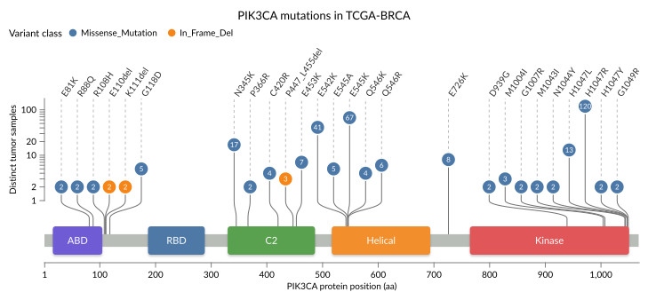

I made the first Git commit nearly eight years ago. The initial version was
largely a proof of concept for WebGL-powered visualization of genomic segments.
One might think it was a technology-driven experiment, which is partially true,
but there was nevertheless a real use case I was trying to solve: the
exploration of copy-number segments in an ovarian high-grade serous carcinoma
cohort. First in the [HERCULES project](https://herculesovca.blog/), and later
in its successor, the [DECIDER project](https://www.deciderproject.eu/).

Copy-number variation is one manifestation of genomic and chromosomal
instability, with features spanning from broad arm-level events to dense
clusters of focal aberrations. Exploring such multi-scale data involves constant
navigation around the genome: zooming, panning, moving between different levels
of detail, and stratifying and comparing samples.

When I was building the initial prototypes, I was also attending a course on
interactive data visualization and happened to stumble upon [_Fluid interaction
for information visualization_ by Elmqvist et
al.](https://doi.org/10.1177/1473871611413180). While I have always been
interested in the user experience in software development and design, I found
that paper really exciting: perhaps genome browsers and similar tools could
better support insight generation by allowing users to stay in the "flow" of
exploration, something I found most existing tools lacking. Elmqvist et al.
compiled a list of design guidelines for fluidity, many of which—like smooth
transitions, direct manipulation, and rewarding interaction—have heavily
influenced GenomeSpy's design.

::: {#fig-early-transitions}



Early GenomeSpy used animated transitions inspired by fluid interaction to make
changes in a sample collection easier to follow. Maintaining this effect,
however, added too much code complexity, and to be honest, it was probably a
bit too flashy.

:::

## Visualization Grammar

The original GenomeSpy was what is now called the [GenomeSpy
App](https://genomespy.app/docs/sample-collections/): an interactive analytics
application for exploring genomic data across sample collections, particularly
cancer cohorts. Underneath it is GenomeSpy Core, a lower-level visualization
package that provides a rendering engine, graphical marks, scales, data loaders
and transformations, and other building blocks. Core and App were initially a
single, bloated package, but nowadays they have clearly separated roles. Over the
years, Core has grown into a general-purpose visualization toolkit that is
useful for all sorts of genomic visualization tasks—and even some non-genomic
ones.

Unlike a traditional genome browser, GenomeSpy does not provide a fixed
collection of track types. Visualizations are instead composed using a
declarative visualization grammar from lower-level building blocks. This enables
much greater flexibility for highly customized visualizations and allows
GenomeSpy to adapt easily to different datasets and applications. However, the
cost is a somewhat steeper learning curve.

Most bioinformaticians are likely familiar with
[ggplot2](https://ggplot2.tidyverse.org/), a grammar of graphics for R.
GenomeSpy owes much of its grammar design to another, slightly less well-known
one: [Vega-Lite](https://vega.github.io/vega-lite/). While not everything in
Vega-Lite fits genomic data cleanly, it got many things right. However,
GenomeSpy's internal architecture is quite different. I designed it for
interaction with large amounts of non-aggregated data, which is particularly
important in genomic exploration but less commonly needed in ordinary
statistical plots.

## Lingering in version 0.x

GenomeSpy has remained in v0.x for years. In semantic versioning,
version zero means that basically anything can still change in a breaking
manner. Still, GenomeSpy's grammar and API have stayed remarkably stable, mostly
because numerous existing visualizations depend on them.

I've nevertheless hesitated to release v1.0. There have always been annoying
corner cases, essential features to be implemented, and documentation has been
insufficient. In addition, much of GenomeSpy's feature set was defined by the
needs of research projects aimed at overcoming drug resistance in ovarian cancer
rather than building polished software products. But the main reason, when I
think about it now, has been my perfectionism, which isn't always a useful
trait.

I graduated some time ago and finally got an opportunity to focus on this
unfinished business. During the last several months, I've fixed quite a lot of
these issues. While I am proficient at writing code, coding agents, especially
OpenAI Codex, have provided an immense productivity boost. Some annoying corner
cases remain, but there always will be. I'm also not nearly done with all the
ideas I've come up with over the years. But importantly, keeping the project at
version zero because of them makes no sense.

I have now taken a bold step: GenomeSpy 1.0 is out.

## What's new in 1.0

There isn't one single feature that defines this release. In fact, there's
nothing new in v1.0, as it is solely a version bump from the earlier v0.90.0.

Much of the recent work has been about making existing pieces more complete and
predictable, something that a user would expect from a relatively mature
visualization package.  Some of that work is described briefly below.

Data support has expanded to formats including Parquet, BED, BEDPE, BAM, and
compressed files, and several new transforms have been added for tasks such as
coordinate lookup, window operations, set intersections, and label displacement.
These building blocks enabled many new non-trivial examples shown in the
[documentation](https://genomespy.app/docs/examples/).

There has also been a lot of work on not-so-exciting features that are still
important when creating plots and visualizations for others to view. Legends,
for example.  Axes and view titles now allocate their required space
automatically, and clipping and layout behave better in dense compositions with
scrollable viewports. Previously, users had to adjust these manually

GenomeSpy uses a GPU-first design. While nearly all PCs, Macs, tablets, and
phones have a GPU, that is not always the case in virtualized environments. The
new canvas renderer, while much slower, now allows GenomeSpy to be used in these
environments and may even be the preferred renderer for visualizations that shown
only a moderate amount of data on the screen.

For a long time, the official way to export figures was to take a screenshot,
which was a bit embarrassing for a visualization toolkit. PNG export provided
some relief, but now there is SVG export that produces publication-quality
vector graphics with automatic rasterization of dense layers like heatmaps and
large scatter plots. In addition, the visualization's hierarchical structure is
replicated in the resulting SVG groups, enabling easy editing in vector art
apps.

::: {#fig-svg-export}

<!-- prettier-ignore -->
{fig-alt="Lollipop plot of recurrent PIK3CA mutations in TCGA-BRCA, with displaced mutation marks above colored protein domains"}

A PIK3CA mutation lollipop plot based on TCGA-BRCA data, exported as SVG. The
new
[`displace1d` transform](https://genomespy.app/docs/grammar/transform/displace1d/)
spreads crowded mutation marks while connectors lead back to their original
protein positions.
[Explore the interactive example](https://genomespy.app/docs/examples/genomic-data/pik3ca-tcga-brca-lollipop/).

:::

## What's next

There are already several breaking changes waiting in the backlog. Now that v1.0
is out, it is clear that those changes will go into v2.0, which I expect to
release in the relatively near future. v2.0 will come with a migration guide
for the grammar and API changes. It will also include new long-awaited features
enabled—or at least significantly made easier—by a WebGPU renderer, which is
already feature-complete for the current grammar, but needs further testing.

GenomeSpy 1.0 also brings something important on the Python side. I've been
collaborating with [Oskari
Lehtonen](https://www.linkedin.com/in/oskari-lehtonen/), who recently created an
[Altair](https://altair-viz.github.io/)-like [Python package for
GenomeSpy](https://genomespy.app/genome-spy-python/), and it is reaching v1.0 at
roughly the same time. A package like that has been on my TODO list for years,
as JSON isn't a typical bioinformatician's mother tongue, while Python could
actually be. It provides a much more convenient way to construct GenomeSpy
visualizations in Python notebooks and analysis workflows.

The Python package removes one important barrier to using GenomeSpy, but it may
not be a drop-in solution for many common workflows: the user still has to
specify a visualization. Many tasks do not need that level of customization, and
a predefined template—or a "track type"—would be perfectly adequate.

Figuring out which of these higher-level building blocks would actually be
useful is one of the next steps. If you use GenomeSpy, or have looked at it and
decided that it takes too much work to get started, I'd be interested to hear
what you were trying to do. Perhaps some of those workflows should simply work
out of the box.

— Kari Lavikka ([linkedin](https://www.linkedin.com/in/karilavikka/))
